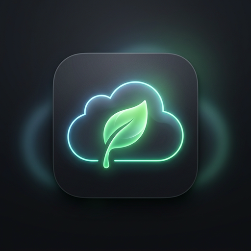
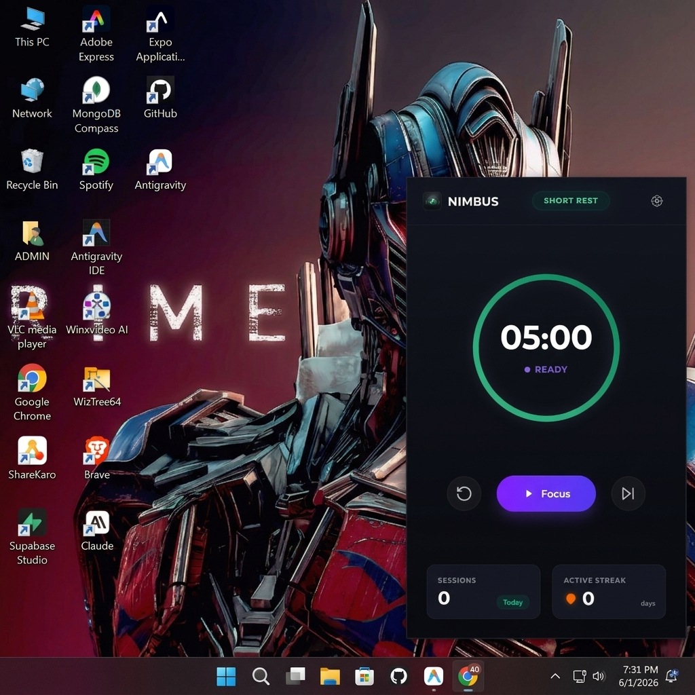
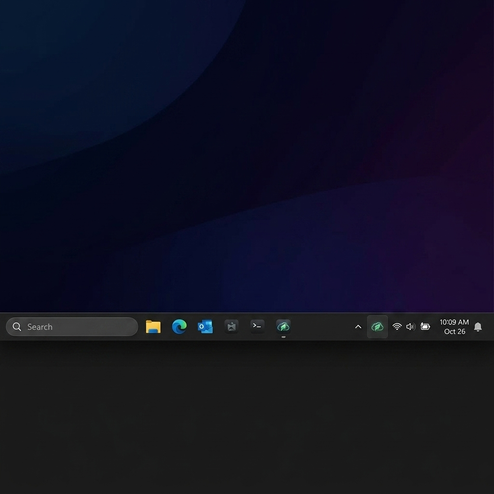
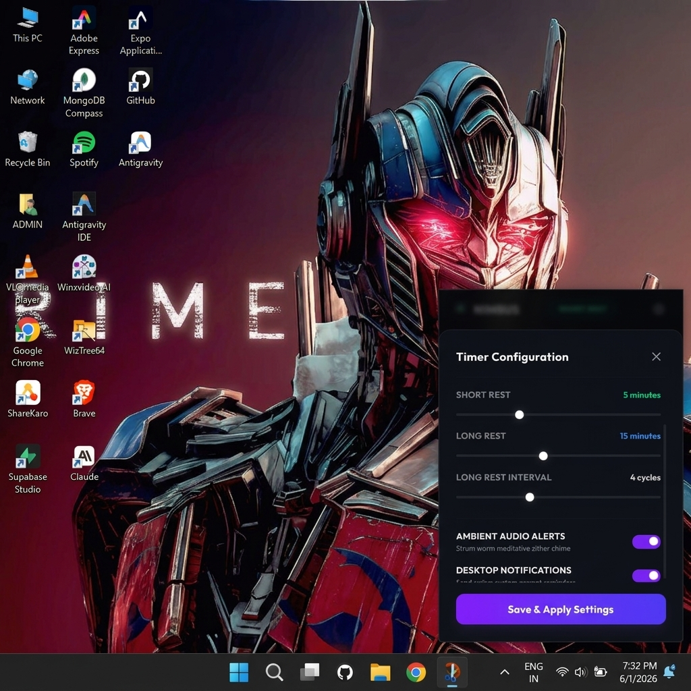
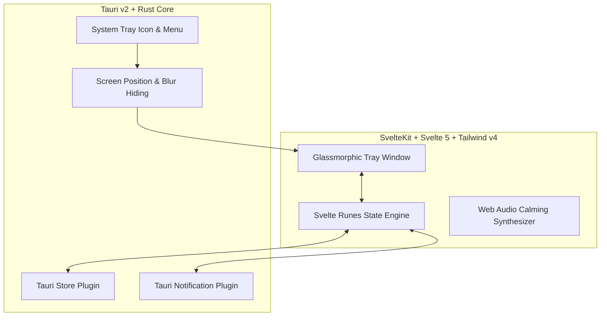

# 🌿 NIMBUS

### *“Work smoothly. Rest intelligently.”*

Nimbus is an ultra-lightweight, premium cross-platform desktop productivity and health companion that lives entirely in your system tray/menu bar. Designed with contemporary macOS and Apple-utility aesthetics in mind, Nimbus helps you maintain an optimal focus rhythm, prevent burnout, and manage your daily streaks using Pomodoro-based focus periods, native OS notifications, and zero-asset programmatically synthesized ambient audio alerts.

---

<p align="center">
  
</p>

<p align="center">
  <strong>Productivity • Wellness • Pomodoro • Desktop Utility</strong>
</p>

<p align="center">
  
  
  
  
  
</p>

---

## 📸 App Interface Previews

Nimbus is designed to look like a premium, integrated desktop utility, sitting seamlessly on top of other applications.

### 1. Main Focus Dashboard & Controls
The main panel utilizes a sharp rectangular metallic surface, customized with centered Lucide-style vector controls, today's statistics, and a linear gradient circular progress ring.

<p align="center">
  
</p>

### 2. System Tray Minimization
Upon launch, Nimbus minimizes into the Windows system tray. The tray icon uses your custom leaf-cloud logo `🌿` and opens the dashboard on left-click.

<p align="center">
  
</p>

### 3. Slide-Up Configuration Settings
Clicking the settings gear button slides in a modal overlay, featuring custom Web Audio-styled sliders, translucent thin scrollbars, and switches to toggle notifications and zen soundscapes.

<p align="center">
  
</p>

---

## 🚀 Key Architecture Map

Nimbus bridges SvelteKit's static client views with a highly-secure Rust core using Tauri v2 capability permissions:



---

## 🛠️ Code Deep Dive & Implementation

### 1. Rust System Tray & Positioning (`src-tauri/src/lib.rs`)
The Rust backend tracks system tray events, handles window focus loss (blur), and calculates screen coordinates:
```rust
// Helper function to position the window at the bottom-right corner, just above the taskbar.
fn position_window(window: &tauri::WebviewWindow) {
    if let Ok(Some(monitor)) = window.primary_monitor() {
        let scale_factor = monitor.scale_factor();
        let monitor_size = monitor.size();
        let monitor_pos = monitor.position();

        let window_width = (360.0 * scale_factor) as u32;
        let window_height = (520.0 * scale_factor) as u32;

        let padding_x = (16.0 * scale_factor) as i32;
        let padding_y = (60.0 * scale_factor) as i32;

        let x = monitor_pos.x + (monitor_size.width as i32) - (window_width as i32) - padding_x;
        let y = monitor_pos.y + (monitor_size.height as i32) - (window_height as i32) - padding_y;

        let _ = window.set_position(tauri::PhysicalPosition::new(x, y));
    }
}
```

Focus loss triggers automatic hiding in the background:
```rust
// Setup blur hiding (auto-hide when clicking outside)
let w = window.clone();
window.on_window_event(move |event| {
    if let tauri::WindowEvent::Focused(false) = event {
        let _ = w.hide();
    }
});
```

### 2. Svelte 5 Reactive Class Engine (`src/lib/stores/timer.svelte.ts`)
We use Svelte 5's `$state` and `$derived` inside a TypeScript class to govern our Pomodoro state machine:
```typescript
export class TimerEngine {
    // Svelte 5 runes for premium reactive state
    state = $state<TimerState>('work');
    status = $state<'idle' | 'running' | 'paused'>('idle');
    timeLeft = $state<number>(25 * 60);
    durationWork = $state<number>(25);
    
    // Derived values are automatically calculated on state change
    totalDuration = $derived(
        this.state === 'work' ? this.durationWork * 60 :
        this.state === 'shortBreak' ? this.durationShortBreak * 60 :
        this.durationLongBreak * 60
    );
}
```

### 3. Programmatic Zen Audio Chime (Zero-Asset Web Audio)
On transition boundaries, Svelte synthesizes an arpeggiated A Major chord (`A4`, `C#5`, `E5`) programmatically, staggering notes to create a zither strum:
```typescript
public playCalmingChime() {
    if (!this.soundEnabled) return;
    try {
        const AudioContextClass = window.AudioContext || (window as any).webkitAudioContext;
        const ctx = new AudioContextClass();
        const now = ctx.currentTime;
        const frequencies = [440.00, 554.37, 659.25]; // A Major Chord
        
        frequencies.forEach((freq, idx) => {
            const osc = ctx.createOscillator();
            const gain = ctx.createGain();
            osc.type = 'sine';
            osc.frequency.setValueAtTime(freq, now + idx * 0.12); // Stagger notes
            
            // Envelope: Fast attack, slow exponential decay
            gain.gain.setValueAtTime(0, now + idx * 0.12);
            gain.gain.linearRampToValueAtTime(0.12, now + idx * 0.12 + 0.08);
            gain.gain.exponentialRampToValueAtTime(0.0001, now + idx * 0.12 + 2.4);
            
            osc.connect(gain);
            gain.connect(ctx.destination);
            osc.start(now + idx * 0.12);
            osc.stop(now + idx * 0.12 + 2.6);
        });
    } catch (e) { console.error(e); }
}
```

### 4. Global Transparency Override (`src/routes/layout.css`)
To prevent the Webview2 layout container from displaying standard white background borders, custom overrides force transparency:
```css
/* Force Webview transparency on all root containers to eliminate white corners */
html, body, #svelte, [style*="display: contents"] {
	background: transparent !important;
	background-color: transparent !important;
}
```

---

## 📦 Exact Tech Stack Specifications

Below are the exact versions utilized in the development, compilation, and packaging of Nimbus:

### ⚙️ System Runtimes
- **Rust Compiler**: `v1.95.0` (Rust 2021 Edition)
- **Node.js**: `v24.14.1`
- **npm**: `v11.11.0`

### 🦀 Rust Backend Dependencies (`src-tauri/Cargo.toml`)
- **Tauri Core SDK**: `v2.11.2` *(with tray-icon support)*
- **Tauri Build Helper**: `v2.6.2`
- **Tauri Plugins**:
  - `tauri-plugin-notification`: `v2` *(Native OS Notifications)*
  - `tauri-plugin-store`: `v2` *(Persistent State Storage)*
  - `tauri-plugin-shell`: `v2`
  - `tauri-plugin-process`: `v2`
  - `tauri-plugin-log`: `v2`

### 🌐 Frontend Web Dependencies (`package.json`)
- **Svelte**: `v5.55.2` *(Svelte 5 Runes)*
- **SvelteKit**: `v2.57.0` *(with static adapter `v3.0.10`)*
- **Tailwind CSS**: `v4.2.2` *(via `@tailwindcss/vite` compiler)*
- **Vite**: `v8.0.7`
- **TypeScript**: `v6.0.2`

---

## 🛠️ Developer Setup & Commands

Ensure you have [Node.js](https://nodejs.org/), [npm](https://www.npmjs.com/), and the [Rust toolchain](https://www.rust-lang.org/tools/install) installed.

### 1. Install Dependencies
```powershell
npm install
```

### 2. Launch Local Development
```powershell
npx tauri dev
```
*Vite compiles the frontend on custom port `5183` (preventing collisions with other local servers) while Cargo watches the Rust backend for changes.*

### 3. Build Web Assets
```powershell
npm run build
```
*This compiles TypeScript and exports SvelteKit statically to `/build` using `@sveltejs/adapter-static`.*

### 4. Package STANDALONE Application
Bundle, optimize, and compile a standalone production-ready Windows binary:
```powershell
npx tauri build
```
*Tauri compiles under the release profile, embedding static frontend assets directly inside the binary. The resulting standalone executable (`app.exe`) and OS installers (`.exe`/`.msi`) are compiled under `src-tauri/target/release/` and are only ~10MB!*

---

## 💡 Troubleshooting & Diagnostics

### 1. Port Collisions (`Port 5173 is in use`)
If you have another Vite project (e.g. *Voxely*) running on the default port `5173`, Vite will automatically shift your dev server to `5174`. However, since Tauri looks for the frontend at `5173`, it will render the wrong app!
- **Our Solution**: Nimbus is hardlocked to port **`5183`** inside Svelte's `vite.config.ts` and set to `strictPort: true`. Tauri's `tauri.conf.json` is set to read from `5183`. This guarantees isolated, clash-free execution.

### 2. File Lock Failures (`Access is denied - os error 5`)
If you try to run `npx tauri build` or `npx tauri dev` while an instance of Nimbus is running in your system tray, the Cargo compiler will fail to overwrite `app.exe` because the file is locked by Windows.
- **Solution**: Terminate the active instance before compiling:
  ```powershell
  Stop-Process -Name "app" -Force -ErrorAction SilentlyContinue
  ```

---

## 📁 Directory Architecture

```text
nimbus/
├── src/                      # SvelteKit + Svelte 5 Frontend
│   ├── lib/
│   │   ├── assets/           # SVG icons and visual assets
│   │   └── stores/
│   │       └── timer.svelte.ts # Svelte 5 Runes state machine
│   ├── routes/
│   │   ├── +layout.svelte    # Root HTML layout renderer
│   │   ├── +layout.ts        # Disable SSR, enable SPA prerender
│   │   ├── +page.svelte      # Timer UI, sliders & settings
│   │   └── layout.css        # Tailwind v4 import & transparency overrides
│   ├── app.d.ts              # TypeScript global definitions
│   └── app.html              # Custom fonts, scrollbar styles & transparent wrapper
├── src-tauri/                # Tauri Rust Backend
│   ├── capabilities/
│   │   └── default.json      # Granular Svelte-to-Rust capability permissions
│   ├── icons/                # System Tray & Application icon files
│   ├── src/
│   │   ├── lib.rs            # Tray icons, blur-hide & dynamic coordinates
│   │   └── main.rs           # Core entry point
│   ├── build.rs              # Tauri compiler build script
│   ├── Cargo.toml            # Rust manifest declaring plugins & tray-icon feature
│   └── tauri.conf.json       # App definitions, opaque overlays, and build paths
├── static/                   # Global Static Web Assets
│   ├── logo.png              # Generated holographic green leaf cloud logo
│   ├── screenshot-dashboard.png # Copied user request dashboard screenshot
│   ├── screenshot-settings.png  # Copied settings panel screenshot
│   └── screenshot-tray.png      # Copied system tray placement screenshot
├── package.json              # Svelte dependencies and Tauri CLI shortcommands
├── vite.config.ts            # Vite custom port configuration (locked to 5183)
└── README.md                 # Project Walkthrough & Developer Documentation
```
